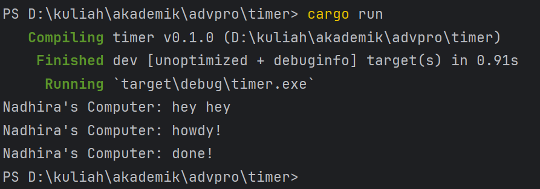
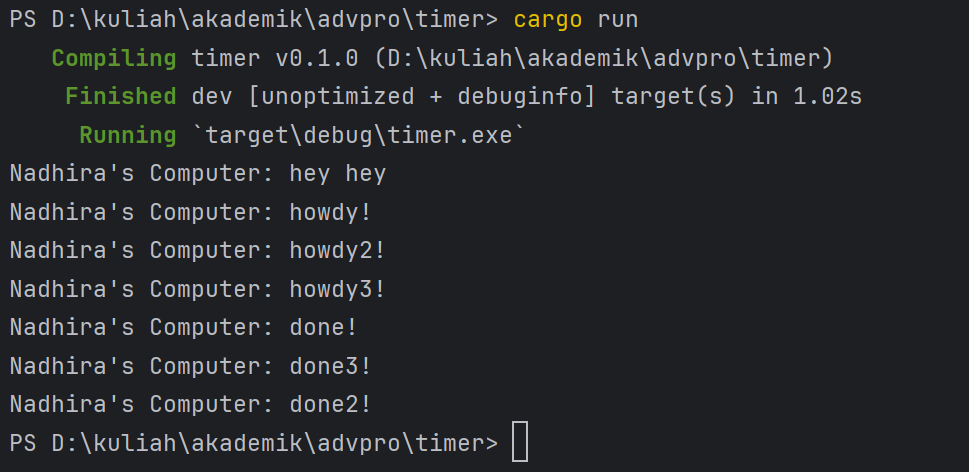
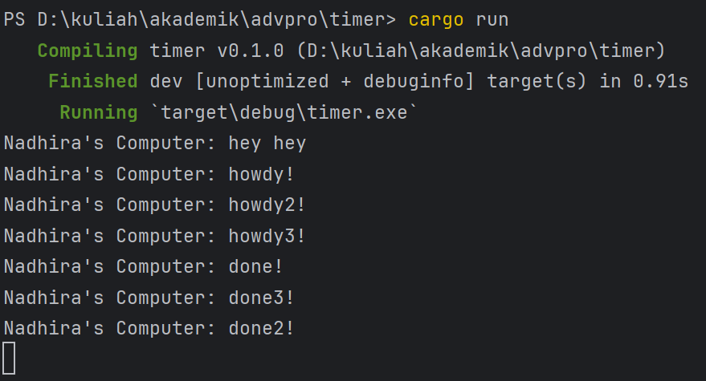

# Tutorial 10
**1.2. Understanding how it works.**

Hal ini terjadi karena `println!("Nadhira's Computer: hey hey");` di luar spawner dan execute terlebih dahulu karena termasuk ke dalam main function sambil menunggu asynchronous function. 

**1.3: Multiple Spawn and removing drop**
1. Multiple Spawn  
   Perintah yang dikerjakan akan dijalankan serentak dengan spawner lainnya dan main function berhenti karena `drop(spawner)` memberi tahu bahwa tidak akan ada lagi tasks yang datang.
      
2. Removing drop  
   Main function tidak akan berhenti sehingga meskipun tasks sudah dijalan semua namum main function akan tetap terus berjalan.
    

